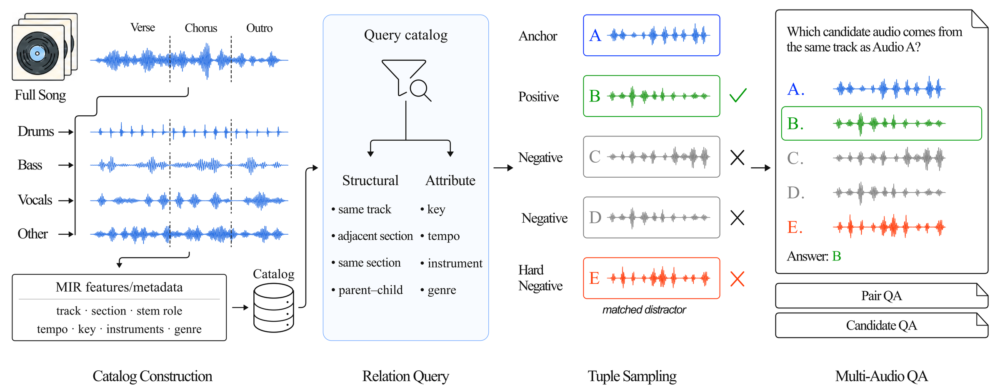

# STEMMA: Song-to-Stem Multi-Audio Reasoning for Large Audio Language Models

### The official GitHub page of the paper "STEMMA: Song-to-Stem Multi-Audio Reasoning for Large Audio Language Models"

- Authors: Hoyeol Sohn, Wonil Kim, Keunhyoung Kim, Sangeun Kum, Taehyoung Kim, Dongjoo Moon, Theerasak Charoenchob, Teeratep Weerapang, Jongpil Lee, Juhan Nam
- Affiliations: Graduate School of Culture Technology, KAIST · Neutune
- Paper: TBD
- Models: [STEMMA-MF2601](https://huggingface.co/hoyso48/STEMMA-MF2601) · [STEMMA-MOSS-Music](https://huggingface.co/hoyso48/STEMMA-MOSS-Music)
- Benchmark: STEMMA-Bench (Hugging Face link TBD; QA annotations only, CC BY-NC-SA 4.0)

## Overview

<div align="center">
  
</div>

## Abstract

**TL;DR: STEMMA builds multi-audio music QA from known song–section–stem provenance. Specifying the relation first and retrieving matching excerpts and hard negatives by catalog query yields labels that do not depend on a language model, and instruction tuning on this data improves multi-audio reasoning of two music LALMs while retaining single-audio music understanding.**

Music understanding often requires comparing excerpts and reasoning about relationships among songs, sections, and stems. However, existing large audio-language models (LALMs) and music question-answering datasets typically operate on single recordings or compare independently sampled tracks with no known production relationship. We introduce STEMMA, a multi-audio music question-answering framework built around production provenance: whether excerpts originate from the same track or section, and which stems belong to which mixtures. Because such relations are sparse under conventional audio-first sampling, STEMMA adopts a relation-first construction strategy: it first specifies a target relation and then queries the catalog for excerpts that satisfy it and hard negatives that do not. Labels are determined directly from catalog provenance rather than generated by a language model from metadata. We build STEMMA-Bench for evaluation and a track-disjoint training set, STEMMA-Instruct. Fine-tuning two LALMs on STEMMA-Instruct improves multi-audio reasoning, with the largest gains on structural relations directly determined by the catalog, while preserving single-audio music understanding.

**Key findings**
- Tuning on STEMMA-Instruct improves every multi-audio benchmark for both backbones. On STEMMA-Bench's structural relations, Music Flamingo gains 59.8 points and MOSS-Music 23.6 points.
- Caption cascades remain competitive on comparisons between independently collected tracks (best on Jamendo-MT-QA: 87.16 vs. 86.22), but not on relations among excerpts that share a source: on STEMMA-Bench structural relations the best tuned model reaches 81.89 against 50.39 for the best cascade.
- Attribute relations (key, tempo, instrument, genre) remain hard: the best score is 35.26 against a chance level of 25, and most systems sit at or below chance.
- Relation MultiQA and coreference teach different skills, and combining them gives more than the sum of their individual gains (+28.24 vs. 23.85 points for Music Flamingo; +6.87 vs. 4.34 for MOSS-Music).

## Data

### STEMMA-Instruct

STEMMA-Instruct is a track-disjoint instruction-tuning set of 194,544 instances, each with one to five audio inputs. It has two equally sized roles (97,272 instances each):

- **Relation MultiQA**: multi-audio QA generated by catalog query, one instance per full song. Relation instances are 48% section-only, 45% section-stem-only, and 7% mixed.
- **Coreference**: two to four full songs from distinct tracks under separate labels (`Audio A`, `Audio B`, ...); the target repeats each song's own full-song answer under its matching label.

The catalog is built from an in-house production set (15,856 songs with authored sections, stems, tempo, key, genre, and instrumentation), JamendoMaxCaps (69,297 songs), and a commercially reusable subset of the Free Music Archive (12,119 songs). For the two public corpora, catalog fields are estimated from audio with SongFormer (sections), SCNet (stems), Essentia (key, tempo), and Discogs-EffNet (genre, instrument tags).

### STEMMA-Bench

STEMMA-Bench is a held-out benchmark of 300 candidate-QA items (an anchor, Audio A, and four candidates, Candidate B–E; chance level 25%) over sections and section stems from 481 songs, generated by the same procedure as the relation half of STEMMA-Instruct but from MUSDB18, MedleyDB, and MoisesDB (100 items per corpus). Its stems are authored rather than separated, and it shares no corpus with STEMMA-Instruct. It contains 127 structural and 173 musical-attribute items, and every item was checked by hand.

### Relations

| Relation | Positive conditions | Units | Question |
|---|---|---|---|
| *Structural* | | | |
| same track | `same(track), different(section)` | Sect., Stem | Which candidate audio comes from the same track as Audio A? |
| adjacent section | `same(track), section + 1` | Sect., Stem | Which candidate excerpt immediately follows Audio A in the original track? |
| same section | `same(track), same(section), different(role)` | Stem | Which candidate audio is a different isolated component from the same recorded section as Audio A? |
| parent–child | `same(track), same(section)` | Sect. → Stem | Which candidate audio is contained within Audio A? |
| *Attribute* | | | |
| same key | `same(key), different(track)` | Sect., Stem | Which candidate audio shares the same musical key as Audio A? |
| same tempo | `close(tempo,3), different(track)` | Sect., Stem | Which candidate audio has a similar tempo to Audio A? |
| tempo order | `greater(tempo,3), different(track)` | Sect., Stem | Which candidate audio is faster in tempo than Audio A? |
| instrument overlap | `overlap(instr,2), different(track)` | Sect. | Which candidate audio shares at least two instrument tags with Audio A? |
| genre overlap | `overlap(genre,2), different(track)` | Sect. | Which candidate audio shares at least two genre tags with Audio A? |

*Sect.* denotes a section excerpt and *Stem* a section stem.

## Results

### Main results

Accuracy (%) across multi-audio reasoning and single-audio music understanding. Each cascade supplies independently generated audio captions to Qwen3.6-35B-A3B. Best and second-best scores are **bold** and <u>underlined</u>, respectively. Parse failures count as incorrect.

| System | MUGEN: Music Analysis | Jamendo-MT-QA | STEMMA-Bench Struct. | STEMMA-Bench Attr. | MMAU-Pro Music | MMAU Mini-Music | MMAR Music | RUL-MuChoMusic |
|---|:-:|:-:|:-:|:-:|:-:|:-:|:-:|:-:|
| *Cascaded systems* | | | | | | | | |
| Audio Flamingo 3 → Qwen3.6 | 50.00 | 71.69 | 48.03 | 24.28 | 58.96 | 70.06 | 41.38 | **68.28** |
| Music Flamingo → Qwen3.6 | 54.00 | **87.16** | 48.03 | 24.28 | 53.67 | 66.77 | 40.39 | 61.14 |
| MOSS-Audio → Qwen3.6 | 53.20 | 77.41 | 40.94 | 22.54 | 49.15 | 56.89 | 42.36 | 50.78 |
| MOSS-Music → Qwen3.6 | 58.00 | <u>86.92</u> | 50.39 | 26.01 | 49.72 | 57.78 | 38.92 | 50.82 |
| *Direct QA systems, pretrained* | | | | | | | | |
| Qwen2-Audio | 19.60 | 53.48 | 22.83 | 22.54 | 43.37 | 60.18 | 39.41 | 48.04 |
| Qwen2.5-Omni | 54.00 | 75.82 | 53.54 | <u>29.48</u> | 66.01 | 68.26 | 51.23 | 45.30 |
| Audio Flamingo 3 | 17.20 | 56.27 | 21.26 | 16.76 | 63.61 | 74.55 | 48.28 | <u>65.90</u> |
| MOSS-Audio | 37.20 | 64.33 | 37.80 | 23.70 | 64.81 | 76.35 | 55.17 | 51.79 |
| Music Flamingo | 27.60 | 78.36 | 22.05 | 17.34 | 67.00 | 73.95 | 48.28 | 22.07 |
| MOSS-Music | <u>62.40</u> | 83.73 | 35.43 | 28.32 | <u>71.93</u> | <u>76.65</u> | <u>57.64</u> | 57.92 |
| *Direct QA systems, fine-tuned* | | | | | | | | |
| Music Flamingo w/ STEMMA-Instruct | 56.40 | 84.78 | **81.89** | **35.26** | 67.70 | 74.55 | 51.23 | 30.12 |
| MOSS-Music w/ STEMMA-Instruct | **63.20** | 86.22 | <u>59.06</u> | 28.90 | **72.28** | **78.44** | **60.10** | 58.66 |

The first four benchmark columns are multi-audio QA; the last four are single-audio QA.

### Training-mixture ablation

Each average weights the columns of the main table equally within its group. Parentheses report percentage-point changes from the backbone's pretrained model. Relation MultiQA + Coreference is STEMMA-Instruct itself.

| Training data | Multi-Audio Avg. | Single-Audio Avg. |
|---|:-:|:-:|
| *Music Flamingo* | | |
| Pretrained | 36.34 | 52.82 |
| Coreference only | 41.89 (+5.55) | 53.45 (+0.62) |
| Relation MultiQA only | 54.63 (+18.30) | 55.38 (+2.55) |
| Relation MultiQA + Coreference | **64.58 (+28.24)** | **55.90 (+3.08)** |
| *MOSS-Music* | | |
| Pretrained | 52.47 | 66.03 |
| Coreference only | 53.31 (+0.84) | **67.72 (+1.69)** |
| Relation MultiQA only | 55.97 (+3.50) | 66.40 (+0.37) |
| Relation MultiQA + Coreference | **59.35 (+6.87)** | 67.37 (+1.33) |

## Models

Both models are full fine-tunes (not LoRA adapters) on STEMMA-Instruct. Each Hugging Face repository includes native Transformers/PyTorch inference code, an API reference, and examples.

| Model | Base model | Weight license |
|---|---|---|
| [hoyso48/STEMMA-MF2601](https://huggingface.co/hoyso48/STEMMA-MF2601) | [nvidia/music-flamingo-2601-hf](https://huggingface.co/nvidia/music-flamingo-2601-hf) | NVIDIA OneWay Noncommercial (academic, noncommercial use only) |
| [hoyso48/STEMMA-MOSS-Music](https://huggingface.co/hoyso48/STEMMA-MOSS-Music) | [OpenMOSS-Team/MOSS-Music-8B-Instruct](https://huggingface.co/OpenMOSS-Team/MOSS-Music-8B-Instruct) | Apache-2.0 |

Quick start (see each model card for details):

```sh
pip install -U huggingface_hub
hf download hoyso48/STEMMA-MOSS-Music --local-dir STEMMA-MOSS-Music
cd STEMMA-MOSS-Music
python -m pip install -r requirements.txt
python examples/generate.py --model . --audio a.wav b.wav \
  --prompt 'Audio A: <audio>
Audio B: <audio>
Compare A and B.'
```

## License

- Code in this repository: Apache-2.0 (see [LICENSE](LICENSE)).
- Model weights follow the license of each model listed above.
- STEMMA-Bench: CC BY-NC-SA 4.0 (QA annotations only; audio not included). The benchmark is intended for research use. Obtain the source audio from MUSDB18, MedleyDB, and MoisesDB through their official channels under their own licenses.

## Citation

If you find STEMMA helpful, please consider citing our paper:

```bibtex
@inproceedings{sohn2027stemma,
  title     = {{STEMMA}: Song-to-Stem Multi-Audio Reasoning for Large Audio Language Models},
  author    = {Sohn, Hoyeol and Kim, Wonil and Kim, Keunhyoung and Kum, Sangeun and Kim, Taehyoung and Moon, Dongjoo and Charoenchob, Theerasak and Weerapang, Teeratep and Lee, Jongpil and Nam, Juhan},
  booktitle = {TBD},
  year      = {2027}
}
```
